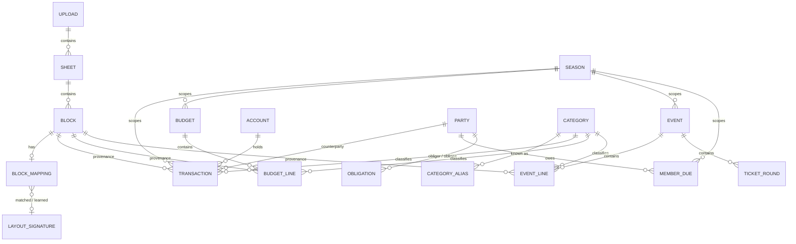

# Shliff Platform — Phase 1: Admin Panel & Workbook Ingestion

**Status:** Proposed
**Date:** 2026-09-09
**Author:** Yarin Shitrit (camp lead), with Claude
**Repository:** https://github.com/Yarin-Shitrit/Shliff-Platform (private)

---

## Intro

### The problem

Shliff camp's entire financial and organizational memory lives in Excel workbooks — one per year or year-pair, each holding between five and eight sheets, each sheet holding several unrelated tables side by side. Four years of history currently sit in three files: `קופת קאמפ 23'-24'.xlsx`, `קופת קאמפ 25'.xlsx`, and `קופת קאמפ 2026.xlsx`, totalling 19 sheets.

This works, badly, and the failure modes are already visible in the data:

- **Nothing is comparable across years.** The camp shade line (`צילייה מחנה`) exists in the 25' and 26' budgets, but answering "did shade get cheaper?" means opening two files and reading them side by side. Event expenses are categorised as `מוסיקה`/`תפאורה`/`לוגיסטיקה`/`כללי` in one sheet and `תוכן`/`רפואה`/`לוגיסטיקה`/`ביטחון`/`ארט` in another, so even within one year the categories don't line up.
- **The books don't balance, and nobody notices.** The 23'-24' ledger closes at **44,647.5**. The 25' ledger opens with a carry-over row (`מעבר לקובץ חדש`) of **44,647.0** — half a shekel vanished in the handoff. The 25' ledger then closes at **44,183.55**, and that money never carried into the 2026 file at all: the 2026 ledger opens directly with an expense.
- **Arithmetic errors survive.** In the 2026 file's `תקציב קאמפ ברן 26`, the `הובלה` line records a unit cost of 12,000 against a total of 9,000. Nothing catches it.
- **The same report exists twice, with different numbers.** `תקציב קאמפ ברן 26` appears in *both* the 25' file and the 2026 file. Nine of its 26 line items disagree, and the two versions assume different camp sizes (35 people vs 40) and different totals (64,375.3 vs 61,847.5). Nobody currently knows which is authoritative.
- **Money owed to people is tracked in ad-hoc corners.** `חוב יוסף`, `קיזוזים`, `להכין מזומן לשלם`, and a 33-row list of micro-reimbursements (`ברגים` 90, `גלידה נטלי` 70, `כבל מקרן` 59, …) are all the same concept — someone fronted money and needs paying back — expressed four different ways in four different places.
- **Only one person can safely touch any of it.** There is no access control, no audit trail, and no way to let a camp member view the budget without handing them the whole workbook.

### Why we got this assignment

The camp is growing — the ברן 26 budget plans for 35–40 members against a 135,000₪ fundraising target and a 61,847.5₪ camp budget — and the leads are now making real financial commitments (a 20,660₪ stage deposit, a 30,000₪ loan, an 8,850₪ container lease) on the basis of numbers no one can verify. Excel has stopped being a record and started being a risk.

The trigger is the 2026 planning cycle. Budget decisions for ברן 26 are being made *now*, against a budget that exists in two conflicting versions. The camp needs a system that can hold both, show the difference, and record which one was chosen — before the money is spent.

This is Phase 1 of a staged build. It deliberately does not attempt to replace Excel; it ingests it, normalizes it, and runs alongside it.

---

## Requirements

### Functional requirements

**Ingestion**

1. The system accepts `.xlsx` uploads. CSV upload is accepted but treated as a single-sheet special case.
2. On upload, the system extracts every sheet, preserving cell values, cell types, number formats, merged-cell ranges, and formula *results* (not formula text).
3. The system detects discrete **blocks** — rectangular islands of related data — within each sheet, without assuming one table per sheet. `SuperNature 18.7` must resolve into its six distinct blocks (expenses, actual income, cash-payer list, Bit-payer list, שליף/אסף expense split, offsets and profit); `סיכום כללי` in the 2026 file must resolve into three (ledger, חוב יוסף, קיזוזים).
4. Each detected block is classified into one of: `ledger`, `budget_lines`, `event_lines`, `ticket_rounds`, `income_channels`, `member_dues`, `obligations`, `account_balances`, or `unknown`, with a confidence score.
5. Each block's source columns are mapped onto canonical fields, with a confidence score per column.
6. Column order must not affect classification. `Shliff Collabo #3` (price, then qty) and `Shliff Gagarin 20.01` (qty, then price) must both resolve to `ticket_rounds` with correct field mapping. `שליף בצרה 08.08` (total first, category last) must resolve to `event_lines`.
7. The system presents every detected block to an admin for confirmation before anything is written to the canonical model, showing: the block's raw grid, its classification, its column mapping, a preview of coerced values, and any validation warnings.
8. When an admin corrects a classification or mapping, the correction is stored as a reusable **layout signature**. A subsequent upload containing a block matching a stored signature is mapped automatically and marked as auto-recognized.
9. Uploading a byte-identical file twice is detected via SHA-256 and does not create duplicate data.

**Value coercion**

10. Numeric coercion strips thousands separators and the ₪ symbol, and handles values stored as text.
11. Where a quantity column contains non-numeric text (`מכולה`, `תפריט שלם לשבוע`, `מקרר תעשייתי`, `12,000kw`, `9,000kw`, `21kwh`), the system stores the numeric part where one exists, the unit where one exists, and always preserves the original text.
12. `?` and equivalent placeholders coerce to null with an `is_unknown` flag, never to zero.
13. Sign convention is detected per column, not per file. The 23'-24' ledger (expenses as negative: `-1170`) and the 2026 ledger (expenses positive in a dedicated column) must both normalize to a positive magnitude plus a direction.
14. Dates that cannot be parsed unambiguously (`01/052024`) are stored as raw text, flagged, and surfaced for admin correction. The system must not guess.

**Canonical model**

15. Every canonical record carries provenance: originating block, originating cell reference, `origin` of `imported` or `manual`, and last-edited-by/at.
16. Budget and event lines each carry both a **planned** and an **actual** amount on a single record.
17. Categories resolve through a canonical list plus an alias table, so that source labels differing across sheets (`מוסיקה`, `תוכן`) map to one canonical category.
18. People and suppliers are a single entity type with role flags; the same person may hold an account, supply a service, owe money, and be owed money.
19. Loans, carry-overs, and offsets are transactions with a distinguishing `kind`, and are excluded from revenue and expense totals.

**Revisions and conflicts**

20. Two uploads producing the same logical report (same season, same archetype, same scope) create two **revisions** of one record, not two unrelated records.
21. The system detects that `תקציב קאמפ ברן 26` in the 25' file and in the 2026 file are revisions of one budget, presents a line-by-line diff of the nine differing items, and requires an admin to mark one revision authoritative.
22. On re-import, each row is resolved by three-way comparison of the incoming value, the current platform value, and the last-imported base value. Where the platform value is unchanged since last import, the incoming value is applied. Where both changed, the row is queued as a conflict with a side-by-side diff and is not written until an admin resolves it.
23. Conflict resolution is recorded — who chose what, and when.

**Validation and reconciliation**

24. Row arithmetic is checked: where quantity, unit cost and total are all present and numeric, `quantity × unit_cost = total`. The `הובלה` line (12,000 × 1 ≠ 9,000) must be flagged.
25. Block totals are checked: a `סה״כ` row must equal the sum of the block's lines.
26. Cross-season chaining is checked: a season's opening carry-over must equal the prior season's closing balance. The 44,647.5 → 44,647.0 discrepancy must be flagged.
27. Account balances are checked: the sum of account balances must equal the ledger's closing balance. The 25' file (1,584 + 28,520 + 14,079.55 = 44,183.55) must validate clean.
28. A missing carry-over is flagged: the 2026 ledger has no opening balance and must be reported as such.
29. Validation failures are warnings, never hard blocks. Real data is wrong; the system records the wrongness rather than refusing the import.

**Access control**

30. Three roles exist: `admin`, `editor`, `viewer`. Phase 1 onboards admins only (3–5 camp leads).
31. Every route and every data mutation is authorization-checked server-side. UI hiding is not the enforcement mechanism.
32. All mutations are written to an append-only audit log recording actor, action, entity, before/after, and timestamp.

**Interface**

33. The admin panel is Hebrew, right-to-left.
34. Amounts render as ILS with thousands separators; dates render in Hebrew locale.

### Non-functional requirements

**Scale — deliberately small.** Three files, 19 sheets, roughly 50 blocks, on the order of 700 canonical rows across four years. Growth is perhaps 20 sheets and a few hundred rows per year, with 3–5 concurrent users. No requirement in this document is motivated by throughput. **Correctness and reviewability dominate; performance work is out of scope.** Any design decision that trades clarity for speed should be rejected.

**Correctness.** Money must never be silently altered. Every canonical value must be traceable to a source cell or to a named person's edit. Ambiguity is surfaced, never resolved by guessing.

**Security.** The data includes named individuals' debts, dues, and payments. All routes require authentication; no page is public. Uploaded files are stored in private blob storage, never in a public bucket. The repository is private and the reference workbooks in `docs/reference-data/` must not be made public.

**Hebrew / RTL.** The interface is RTL throughout, using CSS logical properties rather than left/right. Mixed-direction content (a Hebrew description beside a Latin event name such as `SuperNature 18.7`) must render without bidi mangling.

**Observability.** Each import produces a structured, persisted report: blocks found, classifications with confidence, coercion warnings, validation failures, conflicts raised. This report is visible in the UI, not only in server logs.

**Backward compatibility.** Layout signatures and the parser are versioned. Improving the parser must not silently reinterpret previously committed data; re-running an import against a new parser version is an explicit, reviewable action.

**Cost.** LLM-assisted classification runs once per novel layout and is then cached as a signature. Steady-state cost after the initial three-file backfill approaches zero.

---

## Proposed Implementation

### 1. Storage architecture

**Option A: Two layers — verbatim source blocks, plus a derived canonical model**

Every upload persists the file, its sheets, and each detected block with its raw grid intact. A separate normalization step derives canonical records from those blocks. Both layers are permanent.

Trade-offs:
- Pros: The parser can be improved and re-run over all historical uploads without re-uploading. Conflict review can show what the sheet actually said. A wrong number can be traced to a cell. Layout signatures have something concrete to attach to.
- Cons: ~5 extra tables; a two-step mental model (upload → review → commit).
- Complexity: Moderate. Risk: Low.

**Option B: Parse directly into canonical tables**

Read the workbook on upload, write canonical records immediately, retain the file only as a downloadable attachment.

Trade-offs:
- Pros: Roughly 30% less code in Phase 1; single-step import.
- Cons: A parser fix cannot be applied retroactively. A suspicious number cannot be traced. Conflict review has no source-of-truth evidence to display.
- Complexity: Low. Risk: High — and the risk compounds with every file added.

**Recommendation: Option A.** The decisive argument is empirical: the three reference workbooks already contain a broken date, two text-in-numeric columns, an arithmetic error, a half-shekel reconciliation gap, and a duplicate report with nine conflicting lines. The parser *will* be wrong, repeatedly, and will need to be re-run. Option B makes that recovery impossible without manual re-upload of every file. A template-registry approach was also considered and rejected outright: requiring a hand-authored template per layout contradicts the core requirement that the system identify schemas dynamically.

### 2. Block detection

The hard problem. A sheet is not a table — `SuperNature 18.7` holds six unrelated tables in one grid.

**Option A: Connected-component labelling with gap tolerance**

Build a boolean occupancy matrix of non-empty cells; flood-fill into components, tolerating a one-cell gap.

Trade-offs:
- Pros: Simple, deterministic, fast.
- Cons: Gap tolerance is a single global knob that is simultaneously too aggressive and too timid. Blocks separated by one blank column (common in these files) merge; a table with an internal blank row splits.
- Complexity: Low. Risk: Medium-high — brittle across the observed layouts.

**Option B: Recursive XY-cut (projection profiles)**

The classic document-layout-analysis algorithm. Compute row and column occupancy profiles for a region; find fully-empty rows or columns; cut on the widest separator; recurse on each half, alternating axes; stop when no cut is possible. Produces a tree of regions whose leaves are blocks.

Trade-offs:
- Pros: Handles the observed layouts directly — `סיכום כללי` cuts vertically at the empty E–F columns, then the right region cuts horizontally between the debt block and the offsets block. Deterministic and explainable: every block can be traced to the cuts that produced it. Naturally handles nesting.
- Pros: Degrades gracefully — a failed cut yields one larger block for the admin to split manually, rather than silently wrong boundaries.
- Cons: Fails on genuinely interleaved layouts with no clean separator (none observed in the reference data).
- Complexity: Moderate. Risk: Low.

**Option C: Send the sheet grid to an LLM and ask for block boundaries**

Trade-offs:
- Pros: Handles ambiguity a geometric algorithm cannot.
- Cons: Non-deterministic boundaries; a cost on every sheet; and it applies model judgment to a problem that is purely geometric.
- Complexity: Low. Risk: Medium.

**Recommendation: Option B (recursive XY-cut), with manual split/merge in the review UI as the escape hatch.** Block *geometry* is a solved problem in document analysis and does not need a model; block *meaning* does, and that is the next section. Keeping the two concerns separate makes the geometry testable against fixed expected cell ranges and keeps LLM cost proportional to novel layouts rather than to sheets.

### 3. Block classification and column mapping

Deciding *what* a block is, and which column means what.

**Option A: Rule-based lexicon scoring**

A Hebrew/English keyword lexicon scores each block: `תאריך` + `הוצאות` + `הכנסות` → `ledger`; `כמות יחידות` + `עלות ליחידה` → `budget_lines`; `סבב` + `מחיר` → `ticket_rounds`; `Vibez`/`ביט`/`מזומן`/`פייבוקס`/`בר` → `income_channels`.

Trade-offs:
- Pros: Free, instant, deterministic, trivially testable.
- Cons: Fails on headerless blocks — and several reference blocks have no headers at all (the `חוב יוסף` block is bare label/amount pairs; `Shliff Deco 24` has three unlabelled columns).
- Complexity: Low. Risk: Medium.

**Option B: LLM classification on every block**

Trade-offs:
- Pros: Handles headerless and ambiguous blocks well; reads Hebrew semantics correctly.
- Cons: Cost and latency on every block of every upload; non-deterministic.
- Complexity: Low. Risk: Low-medium.

**Option C: Rules first, LLM on low confidence, cache the result as a signature**

Rules run first. Blocks scoring above a confidence threshold are mapped directly. Blocks below it go to Claude with the block grid, the canonical schema, and the list of known archetypes, using structured outputs so the response validates against a fixed schema. Either way the result is presented for admin confirmation, and the confirmed mapping is stored as a layout signature keyed on the block's shape and header fingerprint.

Trade-offs:
- Pros: Deterministic and free for the common case; model judgment exactly where rules fail. Cost is bounded by *novel layouts*, not by upload volume — after the initial backfill, most blocks hit a cached signature and cost nothing.
- Cons: Two code paths to maintain and test.
- Complexity: Moderate. Risk: Low.

**Recommendation: Option C.** Model: `claude-opus-5` ($5/$25 per 1M tokens), with adaptive thinking and structured outputs (`output_config.format`) so classification responses validate against a fixed schema. A block grid is small — a few hundred tokens — and the whole three-file backfill involves on the order of 50 blocks, of which the rules should resolve the majority. This is a one-off cost measured in cents, after which the signature cache makes recurring imports free. Exact SDK bindings are to be taken from the `claude-api` skill's TypeScript reference at implementation time, not from memory.

### 4. Canonical data model

One viable shape, presented with the consolidation decisions called out.

**Source layer (5 tables).** `upload` (file, SHA-256, uploader, status), `sheet`, `block` (cell range, raw grid as JSON, detected type, confidence), `block_mapping` (column→field map, and whether it came from rules, a model, an admin, or a cached signature), `layout_signature` (shape and header fingerprint → confirmed mapping, versioned).

**Canonical layer (13 tables).**

| Table | Notes |
|---|---|
| `season` | ברן 23 / 24 / 25 / 26. Everything financial is scoped to one. |
| `account` | קופת מזומן, עו״ש אופק, וייבז, ביט, פייבוקס — where money physically sits. |
| `party` | **People and suppliers unified.** אופק holds an account, pays suppliers, and is reimbursed; עזריאל is a supplier who is also owed money. Role flags (`is_member`, `is_supplier`), not separate tables. |
| `category` + `category_alias` | Canonical list plus every observed source label, so `מוסיקה` and `תוכן` resolve to one category. |
| `transaction` | The ledger. `kind` ∈ `normal` \| `carryover` \| `loan` \| `offset` — which is why loans and offsets need no tables of their own, and why the 30,000₪ `הלוואה` is excluded from revenue. |
| `event` | SuperNature 18.7, Gagarin, Halloween, חורשה, … |
| `event_line` | `planned_amount` **and** `actual_amount` on one row, plus category, supplier, paid status, and channel. |
| `ticket_round` | סבב א׳/ב׳/ג׳ — quantity, price, total. |
| `budget` | Scope ∈ `camp` \| `רחבה` \| `fundraising`; carries `revision` and `is_authoritative`. This is what holds the two conflicting ברן 26 revisions. |
| `budget_line` | Item, quantity (numeric + text + unit), unit cost, planned and actual totals, rationale note, payment method, paid status, responsible party, `vat_amount`, `vat_reclaimable`. |
| `member_due` | Party, season, amount, paid, `is_exception` (the 38 רגילים vs the 5 חריגים). |
| `obligation` | **Unifies חוב יוסף, קיזוזים, and the reimbursement lists** — all are "party X owes party Y an amount for a reason, settled or not". |

Provenance columns (`source_block_id`, `source_cell_ref`, `origin`, `updated_by`, `updated_at`) sit on every canonical row.

**Recommendation:** Adopt as specified. Three consolidations are load-bearing and were chosen deliberately over the more granular alternative: merging people and suppliers into `party`, expressing loans/carry-overs/offsets as a transaction `kind`, and unifying three flavours of debt into `obligation`. Each reflects how the source data actually behaves rather than how a textbook ledger would model it. VAT is two columns on `budget_line` rather than its own table because only the `תקציב רחבה ברן 25` sheet uses it; if VAT spreads to other report types it should be promoted to its own table in a later phase.

### 5. Revision detection and conflict resolution

**Logical identity.** A block resolves to a logical report identity of `(season, archetype, scope)`. Two uploads yielding `(ברן 26, budget, camp)` are two revisions of one `budget` — the `תקציב קאמפ ברן 26` case.

**Row identity.** Ledger rows fingerprint on `(date, amount, normalized description)`; budget and event lines on normalized item name within their parent.

**Three-way merge**, which is the mechanism behind the "Excel wins, flag conflicts" rule:

| Incoming vs base | Current vs base | Outcome |
|---|---|---|
| unchanged | unchanged | No-op |
| changed | unchanged | Apply incoming (Excel wins) |
| unchanged | changed | Keep platform edit |
| changed | changed, differently | **Conflict** — queue with side-by-side diff |
| absent | present | Flag as possible deletion; never auto-delete |

`base` is the value as of the last import of that row, stored alongside the current value. Without it, "Excel wins" cannot distinguish a genuine Excel correction from a stale re-upload overwriting deliberate platform work.

**Recommendation:** As specified. Note the deliberate asymmetry: deletions are never applied automatically. A row vanishing from a workbook is far more often a spreadsheet accident than an intentional deletion.

### 6. Validation and reconciliation

Rules run at import and on demand, producing warnings that never block:

| Rule | Reference-data outcome |
|---|---|
| `quantity × unit_cost = total` | **Fails** — `הובלה`, 12,000 vs 9,000 |
| Block `סה״כ` equals sum of lines | Passes broadly; per-block results recorded |
| Season carry-over equals prior close | **Fails** — 44,647.5 → 44,647.0 |
| Account balances sum to ledger close | **Passes** — 1,584 + 28,520 + 14,079.55 = 44,183.55 |
| Carry-over present for each season | **Fails** — 2026 has none |
| Duplicate logical report detected | **Fires** — two ברן 26 budget revisions, 9 differing lines |

**Recommendation:** Implement all six. They are cheap, and every one of them already has a real hit or a real pass in the existing data, which makes them directly testable rather than speculative.

### 7. Authentication and authorization

**Option A: Application-layer authorization**

A single server-side `authorize(user, action, resource)` guard invoked by every server action and route handler; roles stored in Postgres.

Trade-offs:
- Pros: All policy in one testable TypeScript module; straightforward to reason about; no database-context plumbing.
- Cons: Correctness depends on every entry point calling the guard.
- Complexity: Low. Risk: Low at Phase 1 scope (admin-only).

**Option B: Postgres row-level security**

Trade-offs:
- Pros: Defense in depth; policy enforced even if an entry point is missed.
- Cons: Requires per-request role context on every connection; materially harder to debug; and the viewer/editor semantics it would encode are explicitly undecided.
- Complexity: Moderate-high. Risk: Low-medium.

**Recommendation: Option A for Phase 1, with RLS revisited when non-admin users are actually onboarded.** Phase 1 has one role in use. Encoding row-level policy now would mean guessing at viewer/editor visibility rules that have been deliberately deferred. The mitigation for Option A's weakness is structural: all mutations route through a single server-action module that calls the guard, enforced by a lint rule and covered by tests.

Auth mechanism: Auth.js (NextAuth) with a credentials provider and Argon2 password hashing; accounts are created by an existing admin, since Phase 1 covers only the 3–5 camp leads. Google sign-in is deferred to the phase that onboards members.

### 8. Tech stack

**Recommendation** (single option; alternatives were settled during design):

| Concern | Choice | Rationale |
|---|---|---|
| Framework | Next.js (App Router) + TypeScript | One codebase, first-class RTL, deploys on push |
| Database | Postgres (Neon) | Relational model with JSON columns for raw block grids |
| ORM | Drizzle | Explicit SQL-shaped schema; readable migrations |
| XLSX parsing | ExcelJS | MIT-licensed, on npm, exposes cell types, number formats and merged ranges |
| File storage | Vercel Blob (private) | Uploaded workbooks are private financial records |
| Classification | Anthropic TypeScript SDK, `claude-opus-5` | Structured outputs; called only on low-confidence blocks |
| Hosting | Vercel | Free at this scale |
| Testing | Vitest | Fast, TypeScript-native |

A Python parsing service was considered and rejected: the parsing work here is geometric and rule-based rather than statistical, ExcelJS covers what is needed, and a second language and deployment target is not worth the cost at this scale.

### 9. Admin panel

Four screens, Hebrew and RTL throughout:

1. **העלאה (Upload)** — drag-and-drop, with per-file import status.
2. **סקירת ייבוא (Import review)** — the heart of the product. One card per detected block: raw grid on one side, detected type and column mapping on the other, confidence badge, coerced-value preview, validation warnings inline. Blocks matching a stored signature are collapsed and marked auto-recognized. Admin can reclassify, remap, split, merge, or skip. A single Commit action writes the canonical rows.
3. **התאמות (Conflicts)** — the three-way-merge queue, and the revision diff for cases like the two ברן 26 budgets, with an explicit "mark authoritative" action.
4. **נתונים (Data)** — browsable canonical records by season and type, with provenance visible on each row and an inline reconciliation panel showing the six validation rules' current state.

**Recommendation:** Build screens 1 and 2 first; they are the phase's actual deliverable. Screens 3 and 4 follow the canonical model landing.

### 10. Testing strategy

The three reference workbooks are the fixtures. This is unusually favourable: the expected outputs are real, known, and include known-bad data.

- **Block detection (golden tests):** assert exact cell ranges per sheet — `SuperNature 18.7` yields six blocks at fixed ranges; `סיכום כללי` (2026) yields three.
- **Classification:** assert archetype per known block, including the order-swapped ticket tables (Gagarin vs Collabo) and the inverted בצרה layout.
- **Coercion:** table-driven over the real dirty values — `12,000kw`, `9,000kw`, `21kwh`, `מכולה`, `תפריט שלם לשבוע`, `?`, `01/052024`, `-1170`.
- **Validation:** assert each of the six rules fires or passes exactly as tabulated in section 6.
- **Merge:** unit tests over the three-way matrix, including the deletion case.

Development follows TDD, with the golden fixtures written before the parser.

### 11. Delivery sequence

Phase 1 is wide — four archetypes — so it is sequenced internally, each step independently demonstrable:

| Step | Deliverable |
|---|---|
| 1a | Source layer, XLSX extraction, XY-cut detection, upload screen showing detected blocks |
| 1b | Rule-based classification, LLM fallback, mapping review UI, layout signatures |
| 1c | Canonical model + commit pipeline — **ledger first** (`transaction`, `account`, `party`, `category`, `season`) |
| 1d | Budgets, revisions, conflict and diff UI — resolves the ברן 26 case |
| 1e | Events, ticket rounds, income channels |
| 1f | Member dues, obligations, reconciliation dashboard |
| 1g | Auth, roles, audit log |

Steps 1a–1c constitute a genuinely useful system on their own: upload a workbook, see its blocks correctly identified, commit a normalized ledger, and get the reconciliation warnings that the current spreadsheets cannot produce.

---

## Summary

**Chosen approach.** A Next.js + Postgres admin panel that ingests Excel workbooks through a two-layer pipeline: every upload is preserved as verbatim source blocks, from which a normalized canonical model is derived under admin review. Block geometry is found by recursive XY-cut; block meaning by keyword rules with a `claude-opus-5` fallback on low confidence, cached as reusable layout signatures. The platform runs alongside Excel rather than replacing it, with Excel winning re-imports except where a platform edit conflicts, resolved by three-way merge.

**Key decisions.**

1. **Two layers rather than direct parsing** — because the reference data already proves the parser will need fixing and re-running, and a mis-parsed number must be traceable to its cell.
2. **Geometry and semantics split** — XY-cut is deterministic, testable, and free; the model is used only where rules genuinely fail, which bounds cost to novel layouts.
3. **Three consolidations in the model** — people and suppliers into `party`, loans/carry-overs/offsets into a transaction `kind`, and three debt flavours into `obligation` — each following how the source data behaves rather than textbook ledger structure.
4. **Three-way merge with a stored base value** — the only way "Excel wins, flag conflicts" can distinguish a real correction from a stale overwrite.
5. **App-layer authorization for now** — Phase 1 is admin-only, and viewer/editor visibility rules are deliberately undecided; encoding them in RLS today would be guessing.

**Out of scope / follow-ups.**

- **Member onboarding and viewer/editor visibility** — deferred by decision; the roles exist in the model but only admins are onboarded, and the rules for what a viewer sees will be set when members are actually invited.
- **Google sign-in** — arrives with member onboarding.
- **Row-level security** — revisit when non-admin roles are in use.
- **Editing canonical data in the platform beyond conflict resolution** — Phase 2.
- **Cross-year analytics and dashboards** — Phase 2, unlocked by the canonical category mapping this phase establishes.
- **VAT as a first-class entity** — currently two columns on `budget_line`; promote if VAT spreads beyond the רחבה budget.
- **Which ברן 26 revision is authoritative** — an open data question, deliberately left to the system to surface rather than resolved in this document.
