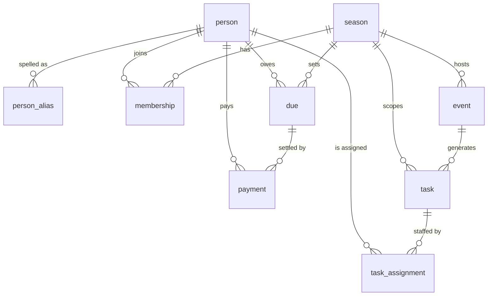

# Shliff Platform — Phase 2: Members, Fees & Work

> **Phase 1 spec:** `docs/superpowers/specs/2026-09-09-camp-data-platform-design.md`
> **Status:** approved in conversation 2026-09-09; implementation plan to follow.

## Intro

### The problem

Shliff is run like a small production company. It has a roster of people, an
annual budget, a set of things that must get built and staffed, and revenue
from fundraising parties — but instead of employees it has burner volunteers
who *pay* to take part and then do the work themselves.

Today all of that lives in spreadsheet columns bolted onto the side of the
cash ledger, and the roster is not actually recorded anywhere. Concretely,
from the camp's own workbooks:

- **The roster is a count, not a list.** `תקציב קאמפ ברן 25` records
  `רגילים 38 → 57,000`, `חריגים 5`, `סה״כ 43 → 60,955`. Thirty-eight people
  paid the flat 1,500 and not one of them is named. Only the five exceptions
  are named — because they had to be, to make the arithmetic work.
- **Why someone paid a different amount is not written down.** The same block
  records `עמירם דהן 0`. Nothing says whether that was a hardship waiver, a
  work-in-lieu arrangement, or a mistake, or who decided it.
- **"Paid" can be true for a reason stored in a different sheet.** In the 2026
  workbook, `דמי קאמפ` marks יוסף, קארינה, ירין, עילאי and יונתן as `שולם`.
  None of them handed over money. The reason is one line in a
  completely different sheet — the `קיזוזים` table under `חוב יוסף`, reading
  `יוסף קארינה יונתן ירין ועילאי — 6,000`. That is exactly 5 × 1,200, the
  ברן 26 per-person rate: five people's dues settled by offsetting a debt the
  camp owed to one of them. Nothing links the two sheets.
- **Money members front personally is tracked by first name in a free-text
  cell.** `תקציב קאמפ ברן 25` has twelve reimbursement lines totalling 5,954
  — `אורי 300`, `לטם 65`, `אופק 400`, `אופק 709`, `אופק 1,605`,
  `תומר גולן 820`, `טלי 200`, `שימי 335`, `איתן 40`, `יובי 580` — and **two
  of the twelve have no name at all** (`שולם 500 — מקפיא באיחסון נוסף`,
  `שולם 400 — דולב זבל במחסן`). The camp cannot now say who to pay back.
- **In the רחבה budget the name is inside the description string**, not in a
  column: `קונטרולר ירין 150`, `ברגים שימי 70`, `חשמל ירין 324`,
  `זכוכית מקרן אלפר 45`, `גלידה נטלי 70`. No query can find "everything the
  camp owes ירין".
- **Ownership of work exists but only for the biggest items.**
  `תקציב רחבה ברן 25` has an `אחראי` column: `מייצג 41,300 → ראנצ׳ו ונטלי`,
  `חשמל 12,950 → אופק`, `הגברה + תאורה 30,810 → עמי`, `הובלה 4,000 → אופק`.
  The remaining nine line items have no owner. Nothing records shifts at the
  burn, build days, or who worked which fundraising party.
- **A member's personal bank account holds camp money.** The ברן 25 income
  block lists `עו״ש אופק — 14,079.55` beside `קופת מזומן — 1,584`.

The single fact that best captures the problem: **אופק appears in the 2025
workbook as three separate reimbursements, two deliverable ownerships, and a
bank account holding camp funds — as five unrelated strings.** There is no
object in the system that is "אופק".

### Why we got this assignment

Phase 1 built the ingestion pipeline and proved the historical workbooks can
be read, segmented and classified. That gives the camp a reliable *record of
what happened*. It does not give it a way to *run the next burn*.

ברן 26 planning is already underway in the workbooks and the numbers have
moved: the per-person rate dropped from 1,500 to 1,200, planned camp size
dropped from 43 to 35, and a new budget line — `הורדת מחיר דמי קאמפ 22,375.3`
— makes the relationship explicit: total camp budget 64,375.3, dues cover
42,000, and **fundraising is expected to cover the remaining 22,375.3 so that
dues can stay low**. That is a production company's P&L, and it is currently
being run from memory and a first-name column.

The leads need a roster they can bill against, a record of who has paid and
why, and a list of what has to be done and who owns it, before ברן 26
fundraising season starts.

## Requirements

### Functional requirements

**Identity**

1. A `person` is a lasting record that survives across burns. The same human
   who appears in ברן 23, ברן 25 and ברן 26 is one `person` row.
2. Every spelling of a name observed in a source sheet is recorded as a
   `person_alias` pointing at one `person` — e.g. `אופק` and `אופק כהן`.
3. **Import never merges two people on its own.** When ingestion sees a name
   that resembles an existing person, it surfaces a candidate link for a lead
   to accept or reject. An unlinked name stays unlinked and is visible as
   such. Auto-merge is prohibited: merging two people's money is not
   reversible from the UI, and the two-second review is cheaper than the
   recovery.
4. A lead can merge two `person` records and can split a merge, with the
   original aliases preserved.

**Roster**

5. A `season` names a burn year (ברן 23, ברן 24, ברן 25, ברן 26).
6. A `membership` records that a person was in the camp for a season, with a
   role. A person may have memberships in some seasons and not others.
7. The roster for a season is listable, countable, and exportable.

**Fees**

8. A season carries a **flat per-person rate** (ברן 25: 1,500; ברן 26: 1,200).
9. A `due` is one person's obligation for one season. It defaults to the
   season's flat rate.
10. A due may be an **exception** with a different amount, including zero.
    An exception **must** record a reason and the lead who decided it. The
    system refuses to save an exception with an empty reason.
11. A `payment` records money actually received against a due: amount, date,
    and **channel**. Channels observed in the workbooks and required at
    launch: `מזומן`, `אשראי`, `ביט`, `פייבוקס`, `העברה בנקאית`, and
    **`קיזוז` (offset against a debt the camp owes the payer)**.
12. A due may have zero, one, or several payments. Instalment *plans* are out
    of scope, but the model must not forbid a due being settled in two goes.
13. A `קיזוז` payment must carry a free-text note naming what it was offset
    against, so the ברן 26 `יוסף קארינה יונתן ירין ועילאי — 6,000` case is
    representable as five payments that each point at the same offset.
14. Per season the system reports: total expected, total collected,
    outstanding, and a per-person breakdown — reproducing
    `רגילים 38 · חריגים 5 · סה״כ 43 → 60,955` as a query result rather than a
    typed-in number.
15. Dues arithmetic is checked and mismatches are **flagged, never blocked**
    — consistent with the Phase 1 constraint.

**Work**

16. A `task` is something that must be done, in one of four kinds:
    - `deliverable` — an owned budget item (`חשמל`, `הגברה`, `מייצג`)
    - `shift` — a staffed time window at the burn
    - `build` — pre-burn construction, logistics, storage, transport
    - `event_task` — work at a fundraising party
17. A task belongs to a season, and optionally to an `event`.
18. A task carries the optional fields its kind needs: budget amount
    (deliverable), start/end time (shift), deadline (build), `people_needed`.
19. A `task_assignment` links a person to a task with a status. One task may
    have many assignments — one for a deliverable owner, four for a bar shift.
20. The system reports **uncovered tasks**: any task whose accepted
    assignments are fewer than `people_needed`. This is the question that
    must be answerable before the gate opens.
21. Everything a given person is responsible for across all four kinds is one
    query — the `אופק → חשמל` + `אופק → הובלה` case.

**Events**

22. An `event` is a fundraising party or the burn itself, with a name, date
    and season. It exists so tasks and (later) revenue can hang off it. It is
    deliberately minimal in this phase.

**Access**

23. Admin-only. Leads record everything; members have no login and no
    self-service surface in this phase.
24. All routes authenticated; no page is public. UI hiding is never the
    enforcement.

**Out of scope, explicitly**

25. **The canonical transaction ledger.** A dues payment is recorded against
    the member; it does **not** yet post to the קופה. Until the ledger phase,
    ברן 25's 60,955 will exist both here and in the workbook.
26. Member self-service, instalment plans, automated reminders, payment
    processing, and per-member visibility rules.

### Non-functional requirements

- **Hebrew RTL throughout**, CSS logical properties only, `<bdi>` isolation
  for mixed Hebrew/Latin/number runs.
- **Never guess.** Consistent with Phase 1: where the system is unsure — a
  name that might be an existing person, an amount that does not reconcile —
  it surfaces the uncertainty rather than resolving it silently.
- **Privacy.** Real names, amounts and debts. Repository stays private;
  nothing member-identifying is logged.
- Scale is trivial (tens of people, one burn a year). **Correctness and
  legibility beat performance everywhere.**
- Additive migrations only; Phase 1's six tables are untouched.

## Proposed Implementation

### 1. Modelling four kinds of work

**Option A: one `task` table with a `kind` discriminator, plus a separate
`task_assignment` table.**

A task is "something to be done, by someone, in some context". `kind`
distinguishes deliverable / shift / build / event_task. Optional columns carry
what only some kinds need. Assignment is its own table, so a deliverable with
one owner and a bar shift needing four people are the same shape.

Trade-offs:
- Pros: one query answers "everything אופק owns"; coverage gaps
  (`assignments < people_needed`) are one query across all kinds; adding a
  fifth kind is a new enum value, not a new table.
- Cons: some columns are null for some kinds; `kind` must be honoured in
  application logic.
- Complexity: low.

**Option B: a separate table per kind.**

Trade-offs:
- Pros: no nullable columns; each kind's constraints expressible in the schema.
- Cons: four near-identical tables sharing ~80% of their columns, four sets of
  queries, four UI paths; "everything אופק is responsible for" becomes a
  four-way union.
- Complexity: high, and the precision buys nothing at this scale.

**Option C: infer the kind from which fields are populated.**

Trade-offs:
- Pros: no discriminator to keep in sync.
- Cons: makes an implicit rule the code must re-derive everywhere. Directly
  contradicts this project's binding "never guess" constraint.
- Complexity: deceptively low, then high.

**Recommendation: Option A.** At 43 members and one burn a year, the cost of a
few nullable columns is nothing and the cost of a four-way union on the most
common question is real. C is ruled out on principle: this system's core
promise is that it does not infer.

### 2. Person identity and linking

**Option A: `person` + `person_alias`, links proposed by import and confirmed
by a lead.**

Import extracts a name, normalises it (Phase 1's `normalizeHebrew`), and looks
for an existing alias. An exact alias match links silently. A near match is
recorded as an unconfirmed candidate and surfaced in the UI. No match creates
an unlinked name that a lead can attach to an existing person or promote to a
new one.

Trade-offs:
- Pros: never merges two people's money; keeps every historical spelling;
  matches the guess-then-confirm-and-learn pattern already established for
  column mapping in Phase 1, so the UI idiom is one the leads have seen.
- Cons: a lead must work a queue after each import.
- Complexity: low. Risk of error: low, and errors are reversible.

**Option B: fuzzy auto-merge above a similarity threshold.**

Trade-offs:
- Pros: no queue.
- Cons: Hebrew first names collide heavily and the corpus is first-name-only
  in most places; a wrong merge silently combines two people's dues, debts and
  ownerships, and there is no signal that it happened. Directly contradicts
  "never guess".
- Complexity: low to build, unbounded to recover from.

**Recommendation: Option A.** The user's own words settle it — "one person,
but linked manually". Note that `person` is deliberately shaped as a general
party record: when the ledger phase lands, suppliers and members should not
fork into two identity systems.

### 3. Dues and payments

**Option A: split `due` (the obligation) from `payment` (money received).**

Trade-offs:
- Pros: channel and date live on the payment where they belong, not on the
  obligation; a due settled in two goes has somewhere to live without
  building instalment plans; `קיזוז` is just another channel, so the
  five-people-one-offset case is five payments referencing one note;
  reconciling dues against the קופה later is a join, not a rewrite.
- Cons: two tables and a join for the common "has X paid?" question.
- Complexity: low.

**Option B: one `due` row carrying `amount`, `paid`, `channel`, `paid_at`.**

Trade-offs:
- Pros: simplest possible read.
- Cons: forces one channel and one date per obligation; part-payment has
  nowhere to go; the offset case cannot be represented without lying about
  the channel; migrating later means rewriting every row and every query.
- Complexity: lowest now, highest later.

**Recommendation: Option A.** The user explicitly ruled out instalments, and
this design does not build them — it just declines to forbid them. The
deciding evidence is the offset: `יוסף קארינה יונתן ירין ועילאי — 6,000` is
not expressible in Option B without misrepresenting how those five people
paid.

**On exceptions:** `due.kind` is `flat | exception`; an `exception` requires
`exception_reason` (non-empty) and `decided_by`. This is a hard validation on
*write* — distinct from the "validation warns, never blocks" rule, which
governs *ingested* data. A lead typing a new exception into the UI is not
ingestion, and `עמירם דהן 0` with no recorded reason is precisely the failure
this phase exists to prevent.

### 4. Schema

| table | key columns |
|---|---|
| `person` | `id`, `display_name`, `notes`, `created_at` |
| `person_alias` | `id`, `person_id`, `alias`, `normalized`, `source` (`manual` / `import`), `confirmed_by`, `confirmed_at` |
| `season` | `id`, `name` (`ברן 26`), `year`, `flat_rate`, `planned_size`, `starts_on` |
| `membership` | `id`, `person_id`, `season_id`, `role`, `joined_at` — unique on (`person_id`,`season_id`) |
| `due` | `id`, `person_id`, `season_id`, `amount`, `kind` (`flat`/`exception`), `exception_reason`, `decided_by`, `created_at` — unique on (`person_id`,`season_id`) |
| `payment` | `id`, `due_id`, `amount`, `channel`, `paid_on`, `note`, `recorded_by`, `created_at` |
| `event` | `id`, `season_id`, `name`, `kind` (`fundraiser`/`burn`), `held_on` |
| `task` | `id`, `season_id`, `event_id?`, `kind`, `title`, `description`, `budget_amount?`, `starts_at?`, `ends_at?`, `due_on?`, `people_needed` (default 1), `status` |
| `task_assignment` | `id`, `task_id`, `person_id`, `status` (`proposed`/`accepted`/`done`/`dropped`), `assigned_by`, `created_at` |

Money follows Phase 1's convention. Amounts are ILS. All timestamps UTC.

**Recommendation:** as tabled. Nine tables, all additive.

### 5. Admin surface

**Option A: three sections under the existing admin shell — חברים, דמי קאמפ,
משימות — reusing Phase 1's nav, palette and card idiom.**

Trade-offs:
- Pros: one visual language; nothing new to learn; the nav already anticipates
  these entries.
- Cons: none material.

**Option B: a single combined "season dashboard" page.**

Trade-offs:
- Pros: one screen answers "where are we".
- Cons: conflates three different editing rhythms — roster changes rarely,
  payments trickle in, tasks churn — into one page that is always partly stale.

**Recommendation: Option A**, with a small season summary on the existing
landing page (`סקירה`): expected vs collected vs outstanding, and the count of
uncovered tasks. Those two numbers are what a lead opens the site to see.

Screens:
- **חברים** — roster per season; person detail showing every alias, due,
  payment and assignment in one place (the "who is אופק" screen); the
  unlinked-names queue.
- **דמי קאמפ** — per-season dues table with the `רגילים / חריגים / סה״כ`
  summary computed, not typed; record-payment action; exception editor that
  demands a reason.
- **משימות** — tasks filtered by kind, with an uncovered-tasks view.

### 6. Seeding from the workbooks

The evidence above is real and already parsed. **Recommendation:** seed
`season` (ברן 23/24/25/26 with their rates), `event` (the named parties), and
the *named* people only — the five ברן 25 exceptions, the twelve
reimbursement names, the four `אחראי` owners, the five offset names. The 38
anonymous `רגילים` are a count, not people: they are recorded as a season
figure, and the roster is filled in by the leads. Inventing 38 placeholder
members to make a total match would be the system guessing.

### 7. Testing

Same discipline as Phase 1: real fixtures, pinned ground truth. The corpus
cases that become tests:

- 38 flat + 5 exceptions = 43 → 60,955 reconciles from `due` rows.
- ברן 26: 35 × 1,200 = 42,000, against a 64,375.3 budget, leaving a 22,375.3
  fundraising target.
- The five-person 6,000 offset produces five settled dues and one shared note.
- אופק resolves to one person holding three reimbursements and two
  deliverable ownerships.
- An exception with an empty reason is refused.
- A near-match name is never auto-linked.

## Summary

- **Chosen approach:** nine additive tables — `person`, `person_alias`,
  `season`, `membership`, `due`, `payment`, `event`, `task`,
  `task_assignment` — behind three new admin sections, admin-only, standalone
  from the cash ledger.
- **Key decisions:**
  1. **One `task` table with a `kind`**, plus a separate assignment table, so
     deliverables, shifts, build work and party tasks answer one query and
     coverage gaps are visible before the gate opens.
  2. **Manual person linking, never automatic.** Import proposes, a lead
     decides. Wrongly merged money is unrecoverable; an unlinked name costs
     five seconds.
  3. **`due` split from `payment`.** Not to build instalments, but because
     channel and date belong to the money, and the `קיזוז` case cannot
     otherwise be told truthfully.
  4. **Exceptions must carry a reason and a decider**, enforced on write.
     `עמירם דהן 0` is the reason this rule exists.
  5. **`person` is a general party record**, so the ledger phase does not fork
     identity between members and suppliers.
- **Out of scope / follow-ups:** the canonical transaction ledger (dues do not
  post to the קופה yet — ברן 25's 60,955 will live in two places until then);
  member self-service and logins; instalment plans; reminders and payment
  processing; linking fundraising revenue to the `הורדת מחיר דמי קאמפ` target,
  which is the natural first story of the ledger phase.
