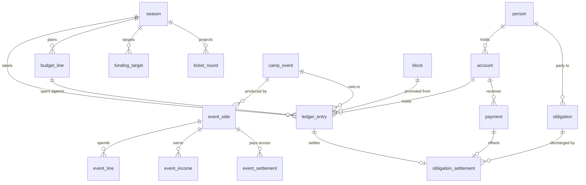

# Shliff Platform — Phase 3: Money Management & the Data View

> **Phase 1 spec:** `docs/superpowers/specs/2026-09-09-camp-data-platform-design.md`
> **Phase 2 spec:** `docs/superpowers/specs/2026-09-09-camp-members-fees-design.md`
> **Status:** approved in conversation 2026-09-12; implementation plan to follow.

## Intro

### The problem

Shliff can say who its members are and what they owe. It cannot say how much
money it has.

That is not an exaggeration. Phase 2 deliberately deferred the canonical
transaction ledger: a dues payment is recorded against the member and posts
nowhere, so ברן 25's collected dues exist both here and in the workbook, and
neither knows about the other. Everything else about the camp's money —
what came in, what went out, what is owed in either direction, and where the
cash physically sits — lives only in spreadsheet cells.

Concretely, from the camp's own workbooks:

- **Money sits in several places at once, one of them a person.** The ברן 25
  `סיכום כללי` sheet carries a `מיקום` block: `קופת מזומן 1,584`,
  `וייבז קלוז פרינדס 28,520`, and `עו״ש אופק 14,079.55`. The last is a
  member's *personal* current account holding camp funds. This is normal in
  this camp and the system must represent it honestly rather than pretend
  there is one account.
- **`סיכום כללי` is already a ledger, and it is tiny.** ברן 25 has eight
  movement rows (`50,770` out, `94,953.55` in, `44,183.55` net); ברן 26 has
  thirteen (`45,271` / `62,000` / `16,729`). The camp does not need a general
  ledger system. It needs *a* ledger.
- **Events are the main income, and they are co-productions.**
  `רווח מסיבה נמל 34,646.55`, `מסיבת האלווין 15,660`,
  `רווח מסיבת פקאנים 57,000`. Behind the last kind of line,
  `SuperNature 18.7` splits every expense and every shekel of income between
  שליף (`35,709`) and a partner, אסף (`20,510`), settles between them
  (`אופק מהוויבז → סוניק של אסף 17,700`), and lands at
  `רווח 49,000` / `26,013`.
- **Debts run in both directions and settle by offset, not cash.**
  `חוב יוסף` totals `15,240` (`10,070 + 3,200 + 800 + 1,000 + 170`), of which
  `14,330` was settled by offsets (`4,410 + 2,780 + 1,140 + 6,000`), leaving
  `910`. The `6,000` line reads
  `יוסף קארינה יונתן ירין ועילאי` — five people's ברן 26 dues at 1,200 each.
  Phase 2 can represent those five payments (`recordOffset`), but they share a
  free-text *string*, not a link to the debt they discharged.
- **Members front their own cash and the camp loses track of who.** The ברן 25
  sheet has twelve reimbursement lines — `אורי 300`, `לטם 65`, `אופק 400`,
  `אופק 709`, `תומר גולן 820`, `טלי 200`, `שימי 335`, `איתן 40`, `יובי 580`,
  `אופק 1,605` — and **two with no name at all**: `שולם 500 — מקפיא באיחסון
  נוסף` and `שולם 400 — דולב זבל במחסן`. They sum to `5,954`, which is exactly
  the `תקציב הפתעות דק׳ 90 — 5,954` budget line in the same sheet. Nothing in
  the workbook says those are the same money.
- **Dues and fundraising are two halves of one budget, and nothing says so.**
  ברן 26 budgets `64,375.3`. `תקציב מחנה` is `1,200 × 35 = 42,000`.
  `יעד גיוס` is `22,375.3`, and a line in the year's fundraising plan is named
  `הורדת מחיר דמי קאמפ 22,375.3` — fundraising explicitly targeted at keeping
  dues low. The rate fell from 1,500 to 1,200 between burns. Divide through by
  35 and the relationship is exact: **1,200 + 639.29 = 1,839.29**, and
  `64,375.3 ÷ 35 = 1,839.29`. That sentence appears in no cell of any workbook.

### The data view

`/data` has a recorded defect, logged as **I8** in
`.superpowers/sdd/2026-09-09-ingestion-pipeline/progress.md`: under
`force-dynamic` it reads the three `.xlsx` files off disk and re-runs block
detection **on every request**, and never touches the database — even though
`blocks.raw_grid` already holds every cell of every block. Upload a new
workbook and it never appears there.

Underneath I8 sits **M14**, parked separately and never connected to it:
because the page reads `docs/reference-data` at runtime, Next traces those
files into the deployed function. The workbooks hold real names, real debts
and real amounts. Ending the disk read ends that too.

### Why we got this assignment

Phase 1 built ingestion. Phase 2 built members, dues and work. Neither built
the thing the camp actually opens a spreadsheet for.

Phase 1 also, quietly, chose this phase's vocabulary. `BLOCK_ARCHETYPES` is
already `ledger, budget_lines, event_lines, ticket_rounds, income_channels,
member_dues, obligations, account_balances`, and `FIELD_TERMS` already maps
`ledger → {date, outflow, inflow, description}` and
`account_balances → {date, account, balance}`. The classifier can already tell
which block is which. Nothing consumes that: `applyConfirmation` writes
`blocks`, `block_mappings` and `layout_signatures`, and **no code anywhere
promotes a confirmed block into a domain row**. Phase 3 closes that loop.

## Requirements

### Functional requirements

**Accounts and the ledger**

1. An `account` is a place money sits: a cash box, a bank account, a member's
   personal account holding camp funds, or an event float. It records who
   holds it when that is a person.
2. An account's balance is **derived**, never stored: opening balance plus
   money in, minus money out.
3. A `ledger_entry` is one movement of money: a date, a direction
   (`in` / `out`), a positive amount, a description, and optionally an
   account, a season, an event and a budget line.
4. **A season is a label on a movement, set by hand, never inferred from the
   date.** `חוב לירון סלע על ברן 25 — 14,000` is dated June 2026 and belongs
   to ברן 25. The ledger is continuous across all years; a season filters it.
5. A movement whose season cannot be determined is stored without one and
   shown as unattributed. The system does not choose a season for it.
6. A transfer between two accounts is two entries sharing a
   `transfer_group_id`, so account balances stay simple sums.
7. **Dues payments post to an account.** `payments` gains a nullable
   `account_id`. A payment whose channel is `קיזוז` moves no cash and must
   never carry an account — this is derivable from the channel, not guessed.
   A payment on any other channel with no account is *unattributed money*, and
   the money page states the total rather than hiding it.
8. The ledger, for reading purposes, is the union of `ledger_entries` and
   `payments`. No dues payment is ever copied into a ledger entry.

**Budgets and fundraising**

9. A `budget_line` is one planned expense for a season: a label, a total, an
   optional unit cost, a rationale, and a category (`camp` / `dancefloor`).
10. **Quantity is stored as text.** The workbook's quantity column holds
    `12,000kw`, `מכולה`, `תפריט שלם לשבוע` and `מקרר תעשייתי` alongside plain
    numbers. A parallel nullable numeric column exists **only** so that
    `quantity × unit ≠ total` stays checkable.
11. Arithmetic mismatches on budget lines are **flagged, never blocked**,
    consistent with Phase 1.
12. `budget_lines` is the single home for a planned amount.
    `tasks.budget_amount` is deprecated in place: kept for existing rows,
    written by nothing. A deliverable task gains `budget_line_id`. A guard
    test asserts no code path writes `budget_amount` again.
13. A `funding_target` is one line of the year's fundraising plan
    (`הורדת מחיר דמי קאמפ 22,375.3`, `הגברה 35,000`, `ארט קאר 25,000` …,
    totalling `135,375.3` for ברן 26).
14. A `ticket_round` records planned or sold ticket revenue
    (`סבב ג׳ 165 × 200`, `סבב ד׳ 195 × 400`, `כרטיסים עד כה 60,000`).
15. The system reports, per season: total budget, dues coverage, fundraising
    target, and **the per-person identity** — full budget ÷ planned size
    against the flat rate, and the fundraising contribution per person that
    closes the difference.

**Obligations**

16. An `obligation` is a debt in one of two directions: `camp_owes` or
    `owed_to_camp`. `חוב יוסף 15,240` and `אורי 300` are the same fact at
    different sizes.
17. An obligation names a party as a linked person, or as raw text when the
    source does not permit a confident link, or **not at all** when the source
    genuinely does not say.
18. An `obligation_settlement` discharges part or all of an obligation, by
    cash (pointing at a ledger entry) or by offset (pointing at a `payment`,
    or standing alone with a mandatory note). The obligation's outstanding
    balance is derived.
19. **An obligation with no party can never be marked settled**, and appears
    permanently in a block that cannot be dismissed, carrying its source cell.
    `שולם 500 — מקפיא באיחסון נוסף` must never again become unrecoverable.
20. The ברן 26 offset is representable end to end: one obligation
    (`חוב יוסף`), one settlement of `6,000`, five `payments` rows, five
    settled dues.

**Events**

21. An `event_side` is one party to a co-production. Exactly one side per
    event is the camp.
22. An `event_line` is one side's expense: description, amount, supplier
    (linked person where possible, text otherwise), and paid / unpaid.
23. `event_income` is recorded **by channel, not by payer**: channel, optional
    quantity (the 728 website tickets), and the gross / fee / net split behind
    `כסף פחות עמלת אתר`. Individual guest payers are out of scope.
24. An `event_settlement` records money moving between sides.
25. **Event detail does not post to the ledger.** Only the event's net result
    does, as it already does (`רווח מסיבת פקאנים 57,000`). An individual line
    may reference a ledger entry when that specific payment moved camp cash.
26. The system computes our profit from lines and income and **compares it
    against the ledger's net entry**. When they disagree it reports the
    disagreement and does not choose a winner.

**Promotion and provenance**

27. `promoteBlock(db, blockId, { dryRun })` turns a confirmed block into
    domain rows, dispatching on archetype, reading `raw_grid` and
    `block_mappings.columnMap`.
28. Every promoted row records `source_block_id` and `source_row`. Promotion
    is idempotent on that pair: re-running updates, never duplicates.
29. `dryRun` reports what would be written without writing it.
30. The promoter **refuses rather than guesses**, and reports every refusal
    with a reason:
    - `מעבר לקובץ חדש 44,647` is a carry-forward, not income. Importing it as
      a movement double-counts the previous book.
    - Any `סה״כ` row is a computed total, not a movement.
    - A reimbursement with an empty name becomes an obligation with no party,
      flagged — never dropped.
    - A name links to a person only when `resolveName` returns exactly one.
      Otherwise the raw string is kept and queued.
31. `accounts.opening_balance` carries what the ledger cannot derive. Where
    the source does not attribute an opening balance to an account, it is
    recorded as an explicitly **unattributed opening** and shown as such,
    until the earlier workbook is back-filled and it becomes derivable.

**The money page**

32. A new admin section, `כספים`, at `/money`, season-scoped.
33. It shows, for a season: the dues/fundraising identity; balance, collected,
    raised and remaining; where the cash is; what is owed in both directions;
    profit per event; the ledger with a running balance; and the budget with
    its 25→26 derivation.
34. Every figure is derived from domain rows. Nothing on the page is typed in.

**The data view**

35. `/data` reads the database only. It never reads a file from disk, and
    `docs/reference-data` leaves the runtime module graph entirely.
36. It shows the **back-fill worklist**: every block with a state —
    unconfirmed, confirmed-but-not-promoted (actionable), or promoted with a
    row count — plus a season × archetype coverage matrix.
37. It traces in both directions: a domain figure back to its source cell, and
    a block forward to the rows it produced.
38. Raw block preview is kept, served from `blocks.raw_grid`.

**Access**

39. Admin-only. Every page and server action calls `requireAdmin()`. UI hiding
    is never the enforcement.

**Out of scope, explicitly**

40. Individual guest payers at events; per-payer door lists.
41. Double-entry bookkeeping, VAT accounting, and anything resembling a
    chart of accounts. `צפי להחזרי מע״מ` in the ברן 25 dancefloor sheet is
    recorded as a note, not modelled.
42. Member self-service, payment processing, reminders.
43. Multi-currency. Everything is ILS.

### Non-functional requirements

- **Never guess.** Where the system is unsure it surfaces the uncertainty.
  This phase's version of the rule is the promoter's refusal list and the
  unattributed-money and unnamed-obligation displays.
- **Hebrew RTL throughout.** CSS logical properties only. `<bdi>` around
  Latin, numeric and mixed-direction runs. All copy in Hebrew.
  **SVG has no logical properties**: chart geometry takes an explicit
  direction and is tested for it.
- **Money is `numeric(12,2)` in Postgres and integer agorot in JS.**
  `src/lib/money.ts` is the only converter. No float arithmetic on money.
- **Blankness checks use `isBlank` from `@/lib/text/normalize`**, never
  `.trim()`.
- `@/db` must never enter the module graph of a `'use server'` file or a test.
  Domain modules take `db: AnyDb` as their first parameter.
- Additive migrations only. Schema files listed explicitly in
  `drizzle.config.ts`; the guard test enforces it.
- Scale is trivial. Correctness and legibility beat performance everywhere.
- The repository stays private. `docs/reference-data/` is read-only.

## Proposed Implementation

### 1. Where dues money lives, once there is a ledger

**Option A: `ledger_entries` holds everything that is not a dues payment;
`payments` gains a nullable `account_id`; "the ledger" is a union query.**

- Pros: additive — one column, one table. No dual write, so a payment can
  never disagree with its ledger entry, because it does not have one. Dues
  collected and cash received reconcile because the payment names the account.
  Phase 2's tested surface is untouched. The `קיזוז`-never-has-an-account rule
  falls out of the channel and becomes a hard invariant test.
- Cons: every ledger read unions two shapes; "one ledger" is a module rather
  than a table.
- Complexity: low.

**Option B: `ledger_entries` is the one table; recording a payment also posts
an entry pointing back at it.**

- Pros: canonical, trivially summable, easy to add a third money source.
- Cons: dual write. `deletePayment` exists today and would silently orphan its
  entry — the same shape as the Phase 2 defect a reviewer caught, where a
  merge destroyed its own undo pointer. Every write needs a transaction and a
  standing invariant.
- Complexity: medium, and permanently so.

**Option C: fold `payments` into `ledger_entries`.**

- Pros: the cleanest end state — one table, no union, no dual write.
- Cons: a destructive migration, which this project forbids, and it rewrites
  `settlementFor`, `recordOffset`, `seasonFeeSummary`, the member dossier and
  their tests. Maximum blast radius on the one money subsystem that is already
  merged and correct.

**Recommendation: Option A.** C is where a greenfield build would land; it is
not worth re-opening tested money code to get there. The union is one module
and everything else reads that module.

### 2. How a workbook block becomes a domain row

**Option A: per-archetype promoters, with `source_block_id` and `source_row`
columns on each domain table.**

- Pros: provenance is a column, so both of `/data`'s jobs — trace a figure to
  its cell, and list confirmed blocks that produced nothing — are one join.
  Idempotency is a unique constraint. A reimbursement with an empty name keeps
  its source cell, so the link is never lost again.
- Cons: two columns on six tables.
- Complexity: low.

**Option B: a separate `provenance` table keyed by (table name, row id).**

- Pros: domain tables stay clean; one place to query.
- Cons: a polymorphic foreign key with no referential integrity. Orphans are
  invisible, which is precisely the failure mode this project cares about.

**Recommendation: Option A.**

### 3. Schema

**Wave 1 — the ledger and the plan.** Seven tables, one column.

| table | key columns |
|---|---|
| `accounts` | `id`, `name`, `kind` (`cash`/`bank`/`personal`/`event_float`), `holder_person_id?`, `opening_balance`, `opening_on?`, `closed_at?` |
| `ledger_entries` | `id`, `occurred_on`, `account_id?`, `direction` (`in`/`out`), `amount`, `description`, `season_id?`, `event_id?`, `budget_line_id?`, `transfer_group_id?`, `recorded_by`, `source_block_id?`, `source_row?` |
| `budget_lines` | `id`, `season_id`, `label`, `quantity_text?`, `quantity_num?`, `unit_cost?`, `total`, `rationale?`, `category` (`camp`/`dancefloor`), `source_block_id?`, `source_row?` |
| `funding_targets` | `id`, `season_id`, `label`, `amount`, `note?`, `source_block_id?`, `source_row?` |
| `ticket_rounds` | `id`, `season_id`, `event_id?`, `label`, `quantity?`, `price?`, `total`, `sold?`, `source_block_id?`, `source_row?` |
| `obligations` | `id`, `direction` (`camp_owes`/`owed_to_camp`), `party_person_id?`, `party_name?`, `description`, `amount`, `season_id?`, `opened_on`, `source_block_id?`, `source_row?` |
| `obligation_settlements` | `id`, `obligation_id`, `amount`, `kind` (`cash`/`offset`), `ledger_entry_id?`, `payment_id?`, `note?`, `settled_on`, `recorded_by` |
| `payments` | **+ `account_id?`** |
| `tasks` | **+ `budget_line_id?`** |

Direction plus a positive amount mirrors the source's two columns
(`הוצאות` / `הכנסות`) and Phase 1's `ledger` field map, and removes a class of
sign error entirely.

**Wave 2 — promotion and provenance.** No new tables. `source_block_id` and
`source_row` on the six tables above, unique together where present, plus the
promoter module and the reworked `/data`.

**Wave 3 — two-sided events.** Four tables.

| table | key columns |
|---|---|
| `event_sides` | `id`, `event_id`, `name`, `person_id?`, `is_camp` |
| `event_lines` | `id`, `event_id`, `side_id`, `description`, `amount`, `supplier_name?`, `supplier_person_id?`, `paid`, `ledger_entry_id?`, provenance |
| `event_income` | `id`, `event_id`, `side_id`, `channel`, `quantity?`, `gross`, `fee?`, `net`, `note?`, provenance |
| `event_settlements` | `id`, `event_id`, `from_side_id`, `to_side_id`, `amount`, `description`, `settled_on?`, `ledger_entry_id?`, provenance |

All amounts `numeric(12,2)`. All timestamps UTC.

### 4. The money page

Seven bands, in this order, because the order is the argument.

1. **The lead is a sentence, not a chart.** A hero figure in Frank Ruhl Libre:
   the flat rate, then the identity that explains it —
   `64,375.3 ÷ 35 = 1,839.29`, `22,375.3 ÷ 35 = 639.29`,
   `1,200 + 639.29 = 1,839.29`. It closes exactly, and it appears in no
   workbook. Beneath it, two horizontal stacked bars — plan over actual, same
   track width, remainder left as unfilled track.
2. **A KPI row** of stat tiles: balance, collected, raised, remaining.
3. **איפה הכסף** — accounts as a horizontal bar list. The personal account
   carries a warning icon and a sentence saying what it is. Unattributed money
   gets its own line.
4. **מה חייבים ומה חייבים לנו** — two tables, a meter per obligation, with
   settlements expanded so `חוב יוסף → 6,000 → five ברן 26 dues` is one
   visible chain. Unnamed obligations sit in a block that cannot be dismissed.
5. **אירועים** — profit per event as a sorted bar list.
6. **התנועות** — the ledger table with a running balance, above it a single
   running-balance line.
7. **התקציב** — budget lines, the 25→26 derivation and the arithmetic flags,
   all moved off `/data` and computed from `budget_lines`.

**Charts.** No chart library is installed and `npm install` is forbidden on
this machine, so charts are hand-rolled SVG components under
`src/components/charts/`, server-rendered, with a thin `'use client'` wrapper
for the hover layer only. Four forms: stat tiles, horizontal bar lists,
meters, one line. Nothing decorative.

**Colour, validated rather than eyeballed.** Series marks use the documented
dark steps `#d95926` (דמי קאמפ — the camp's own money) and `#3987e5`
(גיוס — money from outside), with `#199e70` in reserve. Validated against the
real card surface `#141210` on the all-pairs list: lightness band PASS, chroma
floor PASS, CVD separation worst ΔE 9.4 (deutan), normal-vision worst ΔE 20.9,
contrast ≥ 3:1 PASS.

Two bans, both measured:

- **`--flare #EB7837` never paints a chart mark.** It fails the dark lightness
  band (OKLCH L 0.694 against a 0.67 ceiling) and drops the CVD pair into the
  warn band. It stays what it already is: the UI accent for links and
  warnings.
- **Status `serious #ec835a` is not used on this page.** It sits ~5.8 ΔE from
  series orange and almost on top of the brand flare. Status here is
  good / warning / critical only, always with an icon and a word.

**RTL is a chart defect waiting to happen.** A horizontal bar must grow from
the inline-start edge — the right — and every axis, label anchor and tooltip
offset mirrors with it. `text-anchor="start"` is wrong in Hebrew. Chart
geometry takes an explicit direction parameter and is tested for it.

### 5. Seeding and ground truth

The workbooks contain their own proofs. Each becomes a pinned test.

| closure | check |
|---|---|
| ברן 25 ledger | `94,953.55 − 50,770 = 44,183.55` over 8 entries |
| ברן 26 ledger | `62,000 − 45,271 = 16,729` over 13 entries |
| accounts vs ledger | `1,584 + 28,520 + 14,079.55 = 44,183.55` — the `מיקום` block equals the ledger's bottom line. **The identity holds only with the `44,647` carry-forward included as opening balance**, and the three account rows carry two different dates, so the test is `Σ account balances + unattributed opening == ledger net`, not a naive sum. |
| חוב יוסף, both sub-blocks | `10,070+3,200+800+1,000+170 = 15,240`; `4,410+2,780+1,140+6,000 = 14,330`; remainder `910` |
| reimbursements are the surprises line | the twelve lines sum to `5,954`, exactly `תקציב הפתעות דק׳ 90` |
| the dues/fundraising identity | `42,000 + 22,375.3 = 64,375.3`; `1,200 + 639.29 = 1,839.29` |
| fundraising plan | `15,000+5,000+16,000+35,000+6,000+20,000+16,000+22,375.3 = 135,375.3` |
| ticket projection | `60,000 + 33,000 + 78,000 = 171,000` |
| SuperNature | `35,709 + 20,510`; `49,000 + 26,013 = 75,013` |

Seeding extends `src/lib/seed/camp-seed.ts` and stays as deliberately partial
as it already is: it seeds what the workbooks say and nothing else. The three
ברן 25 accounts, both seasons' ledger entries, the ברן 26 budget, its funding
targets and ticket rounds, `חוב יוסף` with its five component lines and four
offsets, and the twelve reimbursements **including the two with no name**.

### 6. Testing

Same discipline as Phases 1 and 2: real fixtures, pinned ground truth, PGlite,
no writes to the live dev database.

**Mutation testing after each task.** Break the behaviour on purpose and
confirm a test fails. A mutation that survives is the finding. The five to
break first:

1. flip the RTL bar direction → a chart test must fail
2. let a `קיזוז` payment carry an `account_id` → the no-cash-moved invariant
   must fail
3. let the promoter import `מעבר לקובץ חדש` as income → the accounts-vs-ledger
   closure must fail
4. round `639.29` to `639` → the hero identity must fail
5. mark an unnamed obligation settled → must fail

**Seen running, not only green.** Seed, `npm run dev`, open `/money` for both
seasons and `/data`, screenshot each, and confirm the numbers on screen are
the numbers in the table above — before any task is called done. Several
defects in previous phases were visible only in the running app.

## Summary

- **Chosen approach:** eleven additive tables across three waves, plus
  `payments.account_id` and `tasks.budget_line_id`, behind one new admin
  section (`כספים`) and a rebuilt `/data`.
- **Key decisions:**
  1. **The canonical ledger gets built.** "Book for everything" and "cannot
     say where the money is" are incompatible.
  2. **`payments` gains an account; nothing is dual-written.** The ledger is a
     union query, which is additive and makes an orphaned entry impossible.
  3. **A season is a hand-set label on a continuous ledger**, never inferred
     from a date, because `חוב לירון סלע על ברן 25` was paid in June 2026.
  4. **The promoter refuses rather than guesses**, and every refusal is
     reported with a reason and a source cell.
  5. **Event detail never posts to the ledger** — only the net result does —
     and the two are reconciled rather than merged.
  6. **An obligation with no party can never be settled**, and never
     disappears.
  7. **Chart colour is validated, not chosen.** The brand accent is
     disqualified as a series hue by measurement, not taste.
- **Waves, each a stopping point:**
  1. ledger, accounts, obligations, budgets, funding, the money page
  2. promotion, provenance, the `/data` rework
  3. two-sided events and partner settlement
- **Out of scope / follow-ups:** per-payer guest income, VAT, double-entry,
  member self-service, multi-currency.
