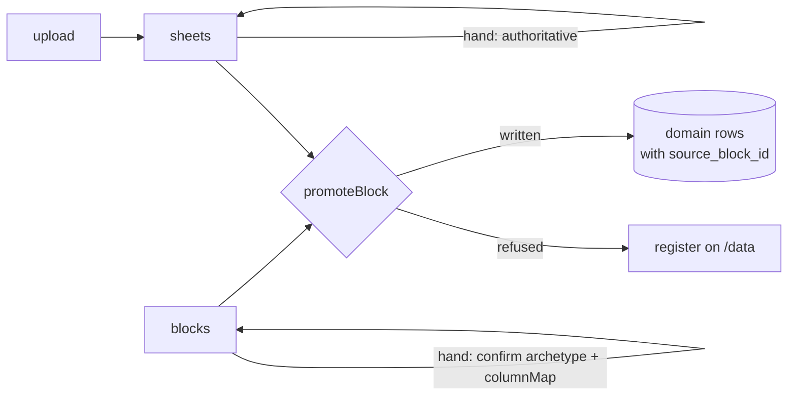

# Shliff Platform — Phase 3 Wave 2: Block Promotion and the Unresolved Register

Parent spec: `docs/superpowers/specs/2026-09-12-camp-money-and-data-design.md`
Wave 1 (the ledger and the money page) is complete and merge-ready at `3a92f91`.

## Intro

### The problem

The camp's three workbooks are already in the database. Every cell of every
block sits in `blocks.raw_grid`, the classifier already knows which block is a
ledger and which is a budget, and an admin can already confirm a block's
archetype and column mapping. Then nothing happens. **No code anywhere turns a
confirmed block into a domain row.** The loop that Phase 1 opened has never been
closed.

Because of that, every figure now on `/money` got there a second way: a person
read the workbooks and typed the numbers into `seedCampBaseline` as constants.
That works, and it is how the camp's real money reached the screen — but it
means the same cells have been read twice, once by hand and once never, and no
figure on the page can be traced back to the cell it came from. Upload next
year's workbook and nothing appears anywhere.

Meanwhile `/data`, the page meant to show what the system knows about its own
data, reads the three `.xlsx` files off disk and re-runs block detection **on
every request**, and never touches the database at all. Confirm a block and
`/data` will not notice. Upload a new workbook and `/data` will not show it.
This is recorded as finding **I8**; beneath it sits **M14**, never connected to
it: because the page reads `docs/reference-data` at runtime, Next traces those
files into the deployed function, and those files hold the camp's real names,
real debts and real amounts.

### Why we got this assignment

Wave 1 built the money subsystem and put the camp's real figures on a page for
the first time. Its final whole-branch review closed with the ledger honest and
the identity closing — and with every single row in it carrying a null
`source_block_id`, because the only writer was the seed.

Wave 1 also left two loaded guns for this wave, both recorded as rulings:

- **R22.** The empty states on `/money` link to `/upload`, telling a lead that
  confirming a block will make figures appear. Today that is false: confirming
  a block writes nothing. The link is only honest once a promoter exists.
- **R27.** `unnamedObligations()` was made camp-wide precisely because *Wave 2's
  promoter is instructed to leave the season unset when it cannot be
  determined*, and a season-less obligation would otherwise reach no page.

The promoter is the thing both of those were built in anticipation of. It is
also what makes the provenance columns Wave 1 shipped mean anything: five money
tables carry `source_block_id` and `source_row` with unique constraints, and
not one row in the database has ever had them set.

## Requirements

Requirements below are numbered `W1…W24`. Where one realises a requirement of
the parent spec, that requirement's number is given in parentheses.

### Functional requirements

**Promotion**

1. **W1** (27) `promoteBlock(db, blockId, { dryRun })` turns one confirmed
   block into domain rows, dispatching on `blocks.archetype` and reading
   `blocks.raw_grid` through `block_mappings.columnMap`. It returns
   `{ written, refused }`.
2. **W2** (29) With `dryRun: true` it computes both lists and writes nothing.
   The dry run and the commit execute the same code path; `dryRun` gates only
   the write.
3. **W3** (28) Every promoted row records `source_block_id` and
   `source_row`. `source_row` is the **absolute 1-indexed sheet row**, not the
   index within the block, so a trace survives re-detection of block bounds and
   renders as a real cell reference.
4. **W4** (28) Promotion is idempotent on `(source_block_id, source_row)`:
   re-running updates in place and never duplicates.
5. **W5** A block owns its rows. Re-promoting a block **deletes** any row
   carrying that `source_block_id` whose `source_row` the block no longer
   produces. Without this, fixing a column map orphans rows that nothing can
   reach.
6. **W6** Wave 2 promotes four archetypes: `ledger` → `ledger_entries`,
   `budget_lines` → `budget_lines`, `ticket_rounds` → `ticket_rounds`,
   `obligations` → `obligations`.
7. **W7** `event_lines`, `income_channels`, `account_balances` and `unknown`
   have no promoter in this wave. A confirmed block of those archetypes is
   refused with a stated reason and appears in the worklist as parked, never
   silently absent.
8. **W8** (30) The promoter refuses rather than guesses, and every refusal
   carries a machine-readable reason and human-readable Hebrew text:
   - `מעבר לקובץ חדש 44,647` is a carry-forward, not income.
   - Any `סה״כ` row is a computed total, not a movement.
   - A reimbursement with an empty name becomes an obligation with **no party,
     flagged** — never dropped.
   - A name links to a person only when `resolveName` returns exactly one
     match; otherwise the raw string is kept and `recordUnlinkedName` queues it.
9. **W9** A promoted `ledger_entries` row has `account_id`, `event_id` and
   `budget_line_id` null. The workbooks name no account for any movement, so
   attributing one would be invention.

**Sheet labelling**

10. **W10** (4) A sheet carries a season, set by hand. The promoter never
    infers a season from a filename, a sheet name, or a date.
11. **W11** (5) Blocks on a sheet with no season promote with `season_id`
    null, and the sheet appears in the register as needing one.
12. **W12** Two sheets **collide** when they share a name and either share a
    season or either one is unlabelled. Same name with two different seasons is
    not a collision — `סיכום כללי` is ברן 25's summary in one workbook and ברן
    26's in another, and both must promote.
13. **W13** For each colliding group exactly one sheet must be marked
    authoritative. Zero marked and two-or-more marked are both refusals with
    distinct reasons; the promoter never breaks a tie by row order.
14. **W14** Blocks on a colliding, non-authoritative sheet do not promote and
    are reported as superseded. They remain readable and traceable.

**Bulk promotion**

15. **W15** One action promotes every confirmed block whose sheet is either
    uncontested or marked authoritative, and reports one combined result. It is
    re-runnable at any time; W4 and W5 make a second run a no-op when nothing
    has changed.

**The register (`/data`)**

16. **W16** (35) `/data` reads the database only. It never reads a file from
    disk, and `docs/reference-data` leaves the runtime module graph entirely.
17. **W17** (36) It shows every block with exactly one state: unconfirmed ·
    confirmed-not-promoted · promoted (with row count) · refused (with reason) ·
    superseded · no-promoter-yet.
18. **W18** (36) It shows a season × archetype coverage matrix.
19. **W19** It shows every sheet awaiting a season, and every collision group
    awaiting an authority decision, with a line-by-line comparison of what
    differs between the copies.
20. **W20** (11) It lists budget lines whose stated arithmetic does not hold
    (quantity × unit ≠ total). Three such rows already exist in the workbooks.
    These are flagged, never blocked.
21. **W21** (37) It traces in both directions: a block forward to the rows it
    produced, and a domain row back to its source cell.
22. **W22** (38) Raw block preview is kept, served from `blocks.raw_grid`.
23. **W23** The budget-derivation section is removed from `/data`.
    `/money`'s `מאיפה התקציב הזה בא` already renders it from the database.
24. **W24** Unlinked names are surfaced by a link to the existing members
    queue, not by a second implementation of it.

### Non-functional requirements

- **Admin-only.** Every page and server action calls `requireAdmin()`. UI
  hiding is never the enforcement.
- **Additive migrations only.** Schema files stay listed explicitly in
  `drizzle.config.ts`; the existing config guard test must stay green.
- **Money is `numeric(12,2)` in Postgres and integer agorot in JS.**
  `src/lib/money.ts` is the only converter; no float arithmetic on money.
- **Blankness uses `isBlank`**, never `.trim()`. A promoted party name of
  invisible directional marks is an unnamed party.
- **Hebrew RTL throughout.** CSS logical properties only. All copy in Hebrew.
  Latin, numeric and mixed-direction runs wrapped in `<bdi>`.
- **`@/db` never enters the module graph of a `'use server'` file or a test.**
  Domain modules under `@/lib` take `db: AnyDb` as their first parameter.
- **`docs/reference-data/` is read-only** and must not be modified. After W16
  it is no longer read at runtime at all.
- **Performance.** `/data` replaces three workbook parses per request with
  database queries plus at most 17 in-memory dry runs over `raw_grid`.
- **Correctness over completeness.** A figure that cannot be derived honestly
  is absent and explained, never approximated.

## Proposed Implementation

### 1. Who owns a workbook fact: the seed or the promoter

`seedCampBaseline` currently writes 19 ledger entries, 28 budget lines, 13
obligations, 8 funding targets and 3 ticket rounds — hand-transcribed from the
same workbooks the promoter would read, all with null provenance.

**Option A: the promoter owns workbook facts; the seed keeps its rulings.**
The promoter becomes the only writer of rows derivable from a block. The seed
shrinks to what no block produces: seasons, people, dues, tasks, events,
accounts and their opening balances, funding targets, and the adjudications.

- Pros: one writer per fact, so no double-counting is possible by construction.
  `source_block_id` becomes an honest discriminator — a row either came from a
  block and can be traced, or came from an adjudication and says so.
- Cons: `/money` is empty for any season until its blocks are confirmed and
  promoted. Any fact with no block stays seed-only and must be visible as such.
- Complexity: medium. Requires a cutover on the live database.

**Option B: the promoter back-fills provenance onto seeded rows.**
It matches derived rows against existing seeded rows and stamps the columns.

- Pros: no cutover; existing figures gain traceability in place.
- Cons: matching hand-transcribed rows to block rows is inference — the exact
  move this project has refused since `resolveName`. A near-miss silently
  overwrites a good row rather than refusing.

**Option C: the promoter handles only newly uploaded workbooks.**
The seeded baseline stands untouched forever.

- Pros: zero risk to existing figures.
- Cons: W21's trace does not work for any figure currently on `/money`, which
  is every figure on `/money`.

**Recommendation: Option A.** Option B is banned inference wearing a
convenience disguise, and Option C delivers a promoter whose output no one can
see for a year. The cutover cost is real but bounded, and section 7 spends a
task on de-risking it with evidence rather than assumption.

What stays with the seed is not a leftover — it is a category. Opening balances
are an adjudication (R10: the `מיקום` block states what the camp counted on a
date; deciding that is an *opening* is a ruling). `funding_targets` has no
archetype in `BLOCK_ARCHETYPES` at all. The 44,647 carry-forward refusal, the
6,000 offset modelled as five members' dues, and the two nameless
reimbursements are all rulings, not transcriptions.

### 2. Promotion trigger and season attribution

A block does not know its season, and W10 forbids inferring one.

**Option A: per-sheet season label, then one bulk promote.**
The lead tags each sheet with a season once on `/data`; one button then promotes
every eligible confirmed block.

- Pros: 19 sheet decisions instead of 29 block decisions, most obvious at a
  glance. A human still sets every season, so W10 holds in substance. Bulk
  promotion is re-runnable and reports one combined result. The season label
  also does double duty as the collision discriminator (section 3).
- Cons: a sheet whose blocks genuinely span two seasons cannot be expressed.
  No such sheet exists in the three workbooks.
- Complexity: low. Two nullable columns, one action.

**Option B: per-block season chosen during confirmation.**
`applyConfirmation` gains a season argument and promotion follows it.

- Pros: maximum precision; handles a mixed-season sheet.
- Cons: 29 decisions; re-promoting after a mapping fix means re-confirming; the
  parent spec's "confirmed-but-not-promoted" worklist state becomes unreachable.

**Recommendation: Option A.** The precision Option B buys is precision over a
case that does not occur in this camp's data, paid for with ten extra decisions
and a lost worklist state.



### 3. Duplicate sheets across workbooks

The same sheet name appears in more than one upload, and this is live rather
than hypothetical:

| sheet | uploads | blocks |
|---|---|---|
| `תקציב קאמפ ברן 25` | `25’.xlsx`, `2026.xlsx` | `budget_lines`, rows 1–32 in both |
| `תקציב קאמפ ברן 26` | `25’.xlsx`, `2026.xlsx` | `budget_lines`, rows 1–26 vs **1–39** |
| `סיכום כללי` | `25’.xlsx`, `2026.xlsx` | `ledger`; also `account_balances` / `obligations` |

Promoting all of them writes ברן 25's camp budget twice and ברן 26's twice from
two different revisions. `budgetTotalAgorot` would roughly double and the dues
identity would report a per-head cost near three times the 1,200 rate — on the
page whose entire argument is that it states a true sentence.

But the three rows above are not one problem. The two `תקציב קאמפ ברן 26`
copies are one season's budget written twice. The two `סיכום כללי` copies are
**different years**, and forcing a choice between them would delete a year of
the camp's history.

**Option A: collision keyed on `(sheet name, season)`, resolved by hand.**
Two sheets collide when they share a name and either share a season or either
is unlabelled. The lead marks one copy of each colliding group authoritative,
using a line-by-line diff of the copies as the decision aid.

- Pros: separates a revision from a different year using a label a human has
  already set. Never guesses. An unlabelled sheet refuses rather than
  double-counts, and resolves the moment it is labelled. The diff view already
  exists on `/data` and is repointed from two files to two `raw_grid`s.
- Cons: one more hand-set flag; a half-finished decision blocks promotion.
- Complexity: low.

**Option B: newest upload wins, flagged for review.**
The most recent copy of a sheet name supersedes older ones automatically.

- Pros: zero decisions.
- Cons: "newest" is a proxy for "most correct" that the system, not the lead,
  applies. A stale re-upload silently overwrites a good revision. It would also
  collapse the two `סיכום כללי` sheets and destroy a year of data.

**Option C: per-block authority instead of per-sheet.**

- Pros: the budget could be taken from one file and the obligations from
  another.
- Cons: more decisions, and it permits an internally inconsistent mixture of
  two revisions of one sheet.

**Recommendation: Option A.** Option B's failure mode is silent data loss on
data that exists today. Option C's extra freedom is a freedom to be
inconsistent.

### 4. Promoter module shape

**Option A: one module per archetype behind a dispatching entry point.**

```
src/lib/import/promote/
  types.ts        PromotedRow, Refusal, RefusalReason, PromotionResult
  rows.ts         raw_grid -> { sheetRow, cells }, header-run skip,
                  shared סה״כ / blank-row / carry-forward detection
  ledger.ts       cells -> ledger_entries input | Refusal
  budget.ts       cells -> budget_lines input | Refusal
  tickets.ts      cells -> ticket_rounds input | Refusal
  obligations.ts  cells -> obligations input | Refusal
  promote.ts      promoteBlock: dispatch, apply columnMap, write, delete orphans
```

- Pros: each archetype promoter is a pure function from mapped cells to a
  row-or-refusal, testable table-driven with no database. `promote.ts` is the
  only file that touches the database, so the write path is reviewed once.
  Files stay small enough to hold in context.
- Cons: five files instead of one.
- Complexity: low.

**Option B: a single `promote.ts` with a switch.**

- Pros: one file.
- Cons: every archetype's parsing tangles with the shared write path, so no
  archetype can be tested without a database. On this project that has been the
  difference between a mutation that dies and one that survives.

**Recommendation: Option A.** The parsing rules are where the refusals live,
and refusals are the part of this wave most worth testing in isolation.

Sheet labelling lives separately in `src/lib/import/sheets.ts`:
`setSheetSeason`, `setSheetAuthority`, `collisions(db)`.

### 5. Schema

Migration `0005`, additive, two nullable columns on `sheets`. No new tables.
`src/db/schema/source.ts` is already listed in `drizzle.config.ts`, so the
config guard test needs no change.

| column | type | meaning |
|---|---|---|
| `season_id` | `uuid` → `seasons.id`, nullable | the season set by hand; null means undecided |
| `authoritative` | `boolean`, nullable | true on the chosen copy of a colliding group; null on the rest |

`source.ts` gains an import from `camp.ts`. This is acyclic: `camp.ts` imports
from no other schema file, and `money.ts` already depends on both.

**A correction to the parent spec.** It states that Wave 2 adds
`source_block_id` and `source_row` to "the six tables above". Wave 1 put them
on **five**: `ledger_entries`, `budget_lines`, `funding_targets`,
`ticket_rounds`, `obligations`. `obligation_settlements` has none, and needs
none — a settlement is derived or adjudicated, never promoted. `accounts` has
none either, which is one of the three reasons `account_balances` is not
promoted in this wave (section 6).

### 6. Why `account_balances` is refused rather than promoted

It is one block, and promoting it looks cheap. Three reasons compound against
it:

1. `accounts` carries no `source_block_id` / `source_row`, so promotion would
   require widening a table Wave 1 deliberately left alone.
2. `accounts.name` is `unique`, so promoting the `מיקום` block collides head-on
   with the three accounts the seed already creates.
3. R10 established that reading a `מיקום` balance *as an opening balance* is an
   adjudication: the block states what the camp counted on a date, and deciding
   that this constitutes an opening is a ruling. That is precisely the category
   section 1 assigns to the seed.

**Recommendation: refuse it with a stated reason** — balances are adjudicated,
not promoted — so it appears in the register rather than being silently absent,
and no migration touches `accounts`.

### 7. The cutover

The live database holds seeded money rows with null provenance. Section 1 says
the promoter takes ownership of workbook facts, so those rows must go — but
which ones is not knowable from column maps alone.

Clean splits are already visible. `funding_targets` has no archetype, so its 8
rows stay seeded permanently. Opening balances stay seeded per R10. But
`obligations` appears to split **partially**: the two `obligations` blocks are
the `קיזוזים` / `חוב יוסף` tables, while the twelve ברן 25 reimbursements look
to live inside a `budget_lines` block. Partial overlap is the worst case,
because it is the one where a blanket delete loses a fact that nothing will
re-create.

**Option A: dry-run first, then decide.** Before any deletion, run the promoter
in `dryRun` over all 17 eligible blocks against the live data and diff its
output against the seeded rows, row by row. The cutover script is then written
against evidence.

- Pros: the one failure mode that matters — deleting a fact no block produces —
  is detected before anything is deleted. It is the same "see it in the running
  app" discipline that caught both of Wave 1's running-app defects, neither of
  which any test could see.
- Cons: one task's delay before the cutover.

**Option B: delete every money row with a null `source_block_id`, then promote.**

- Pros: one command, no analysis.
- Cons: deletes the funding targets, the opening balances and the adjudicated
  obligations, none of which any block will re-create. Recoverable only by
  re-running a seed that no longer writes them.

**Recommendation: Option A**, as an explicit task in the plan whose output is
the cutover script, not a script written up front and trusted.

### 8. Where refusals live

**Option A: computed on demand.** `/data` runs `promoteBlock(db, id,
{ dryRun: true })` over the confirmed blocks and renders the result.

- Pros: the register can never drift from what a commit would actually do,
  because it *is* what a commit would do. No new table, matching the parent
  spec's "no new tables" constraint for this wave. Seventeen in-memory dry runs
  over `raw_grid` is cheap next to the three workbook parses it replaces.
- Cons: recomputed per request; would need revisiting at a scale this camp will
  not reach.

**Option B: persist a `promotion_runs` table.**

- Pros: history of what each run did; cheaper page loads.
- Cons: a new table, and a register that reports the *last run* rather than the
  *current truth* — stale the moment a column map changes, which is exactly
  when a lead is looking at it.

**Recommendation: Option A.** A register that can lie about the current state
is worse than no register, and this is a page a lead opens precisely when they
have just changed something.

### 9. `/data` composition

One job: everything the system could not settle. Sections ordered by what
demands action.

1. **Sheets needing a decision** — season unset, or an authority choice open,
   each collision group showing its copies side by side with the line-by-line
   diff of what differs.
2. **The worklist** — every block in exactly one state (W17).
3. **Season × archetype coverage matrix** (W18).
4. **Refusals, grouped by reason** (W8).
5. **Flagged arithmetic** — budget lines where quantity × unit ≠ total (W20).
6. **Trace, both directions** (W21).
7. **Raw block preview**, from `raw_grid` (W22).

Deleted: `readFileSync`, `extractWorkbook` and `detectBlocks` at request time,
the `DIR` / `FILES` constants, `budgetLines`, `totalsByItem`, the derivation
computation and `DerivationRow`. The revision comparison survives, repointed
from two files to two `raw_grid`s, where it becomes the decision aid for W13.

New modules: `src/lib/data/worklist.ts` for the register's queries,
`src/lib/money/trace.ts` for both trace directions.

**Testing note.** `/data` has no test file today. It gets one.

### 10. Testing

Per-archetype promoters test as pure functions, table-driven, with no database.
`promoteBlock` tests against `createTestDb()`. Fixtures are **real `raw_grid`
excerpts pulled from the live database**, not invented grids — the Wave 1
pattern where the workbooks prove the arithmetic.

Behaviours that must each have a test that fails when the behaviour is broken:

- Promote twice → row counts stable, no duplicates (W4).
- Promote, fix the `columnMap` so a line now refuses, re-promote → the orphaned
  row is **deleted** (W5).
- Both copies of `תקציב קאמפ ברן 26` confirmed, neither marked → refusal, and
  `budgetTotalAgorot` unchanged (W12, W13).
- Both `סיכום כללי` copies labelled to different seasons → **both** promote
  (W12).
- One test per refusal reason in W8.
- A party name of only invisible directional marks reads as unnamed (`isBlank`).
- A promoted ledger row has a null `account_id` (W9).
- `/data` renders without `docs/reference-data` being readable (W16).

Per the phase's working agreement: after each task passes, break each behaviour
on purpose and confirm a test fails. A surviving mutation is the finding worth
having.

## Summary

- **Chosen approach.** A per-archetype promoter behind `promoteBlock(db,
  blockId, { dryRun })` covering `ledger`, `budget_lines`, `ticket_rounds` and
  `obligations` — 17 of the 29 blocks. The season is set by hand per sheet;
  duplicate sheets are resolved by a hand-set authority flag keyed on
  `(name, season)`; one bulk action promotes everything eligible. `/data` is
  rebuilt as the register of what the system could not settle, reading the
  database only.

- **Key decisions.**
  1. *The promoter owns workbook facts; the seed keeps its rulings.* Reading
     the same cells twice is double-counting, and back-filling provenance by
     matching is the inference this project has refused since `resolveName`.
  2. *A collision is `(sheet name, season)`, not sheet name alone.* Sheet name
     alone would have forced a choice between ברן 25's `סיכום כללי` and ברן
     26's and deleted a year of the camp's history.
  3. *A block owns its rows.* Re-promotion deletes rows the block no longer
     produces, because "updates, never duplicates" leaves orphans unreachable
     after a column-map fix.
  4. *Refusals are computed, never stored.* A register that reports the last
     run rather than the current truth is stale exactly when it is consulted.
  5. *`account_balances` is refused, not promoted.* No provenance columns, a
     unique-name collision with the seed, and R10 already ruled that reading a
     `מיקום` balance as an opening is an adjudication.

- **Out of scope / follow-ups.**
  - `event_lines` and `income_channels` (7 blocks) wait for Wave 3's
    `event_sides` / `event_lines` / `event_income`. Designing two-sided events
    under promoter pressure would be designing it badly.
  - `funding_targets` has no archetype in `BLOCK_ARCHETYPES`. The camp's
    eight-line fundraising plan sits below the `סה״כ` row inside a budget
    sheet, so giving it a source means either a new archetype or a rule that
    splits a budget block — both reopen Phase 1's classifier, which nothing
    else in this wave touches.
  - Requirement 12 of the parent spec (`budget_lines` as the single home for a
    planned amount) stays scaled per R5 until a budget-line picker replaces
    `new-task-form`'s `budgetAmount` field.
  - `תקציב רחבה ברן 25` is classified `ledger` but is the dancefloor's budget.
    Promoting it as 35 movements would post a budget as cash that moved. The
    fix is re-picking its archetype at confirm time, which `applyConfirmation`
    already supports — a known step in the first pass through the blocks, not a
    code change.
  - No write UI for money rows. `/money` stays read-only; the promoter and the
    seed remain its only writers.
